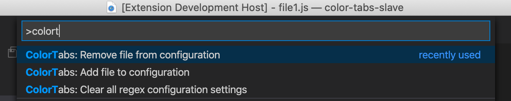

# ColorTabs for vscode


<!-- TOC -->

- [ColorTabs for vscode](#colortabs-for-vscode)
    - [Quick Usage](#quick-usage)
    - [Extension Settings](#extension-settings)
    - [Advanced Settings](#advanced-settings)
    - [What's new](#whats-new)
    - [Notes and known issues](#notes-and-known-issues)

<!-- /TOC -->

## Quick Usage
In the menu choose the folders you want to add/remove



## Extension Settings

This extension contributes the following settings:

* `colorTabs.config`:  list of mappings from path to color         
"default": 
```json
    [
        {
            "regex": ".*\/web\/.*"
        },
        {
            "regex": ".*\/mobile\/.*"
        }
    ]
```

* `colorTabs.statusBarBackground`:  Enable statusBar background coloring. default to `true`
* `colorTabs.tabBorder`:  Enable tab border coloring. default to `true`
* `colorTabs.titleBackground`:  Enable title background coloring. default to `false`
* `colorTabs.activityBarBackground`:  Enable activityBar background coloring. default to `false`
* `colorTabs.titleLabel`:  Enable title label. default to `false`
* `colorTabs.ignoreCase`:  Ignore case while matching Regex. default to `false`

## Advanced Settings
If you'd like to choose the colors yourself, and/or add a label (which is presented at the top window bar).    
Note - you can mix the configuration, placing colors in some, and not in others.
An **advanced** `workspace.settings` example : 

```json
"colorTabs.config": [
        {
            "regex": ".*\/mobile\/.*",
            "color": "#FF0000",
            "label": "MOBILE"
        },
        {
            "regex": ".*\/web\/.*",
            "color": "#00FF00",
        },{
            "regex": ".*\/desktop\/.*"
        },
    ]
"colorTabs.titleBackground": true    
"colorTabs.ignoreCase": true    
```


## What's new


* [0.13.0]
    - Added `colorTabs.tabBackground` configuration, defaults to `false` -  [PR #61](https://github.com/oreporan/color-tabs-vscode/pull/61)    
     set `colorTabs.tabBackground` to `true` in your workspace settings to get this new feature.


* [0.12.0]
    - Ability to add/remove/clear the current file directly from the menu palette - [PR #36](https://github.com/oreporan/color-tabs-vscode/pull/46)  
    

* [0.10.0]
    - Stop writing an empty object to settings when colorTabs doesn't find any regex mapping - [PR #36](https://github.com/oreporan/color-tabs-vscode/pull/36)  


* [0.9.0]
    - Added `colorTabs.ignoreCase` configuration, defaults to `false` -  [PR #29](https://github.com/oreporan/color-tabs-vscode/pull/29)    
     set `colorTabs.ignoreCase` to `true` in your workspace settings to get this new feature.

     
* [0.8.0]
    - Introducing `AutoColoring` - You no longer need to provide a list of colors to map to, `ColorTabs` will generate consistent colors for your list of regular expressions. This configuration is enough:
    ```json
    {
        "colorTabs.config": [
            {
                "regex": ".*/web/.*",
            },
            {
                "regex": ".*/mobile/.*",
            }
        ]
    }
    ```


* [0.6.0]
    - ColorTabs now changes the color of your status bar (set to `true` by default) - [PR #10](https://github.com/oreporan/color-tabs-vscode/pull/10).    
    set `colorTabs.statusBarBackground` to `true` in your workspace settings to get this new feature.

    - ColorTabs can now change the color of your activity bar (Left side bar) - [PR #10](https://github.com/oreporan/color-tabs-vscode/pull/10).    
    set `colorTabs.activityBarBackground` to `true` in your workspace settings to get this new feature.


* [0.5.0]
    - ColorTabs can now add a label to your title background as well - [PR #4](https://github.com/oreporan/color-tabs-vscode/pull/4).    
    set `colorTabs.titleLabel` to `true` in your workspace settings to get this new feature.
    Example (with `mobile` label):
    


* [0.4.4]

    - ColorTabs can now color your title background as well - [PR #2](https://github.com/oreporan/color-tabs-vscode/pull/2).    
    set `colorTabs.titleBackground` to `true` in your workspace settings to get this new feature.
    Example:
    


## Notes and known issues
* This plugin writes to your vscode workspace `settings.json`, this means that it creates a git commit. To avoid pushing this change, you should have your `.vscode` directory in `.gitignore`. Currently writing to the `settings.json` is the only way to manipulate the colors in runtime.
* The regular expression is matched against the relative path of the file (to the workspace), not just the file name.