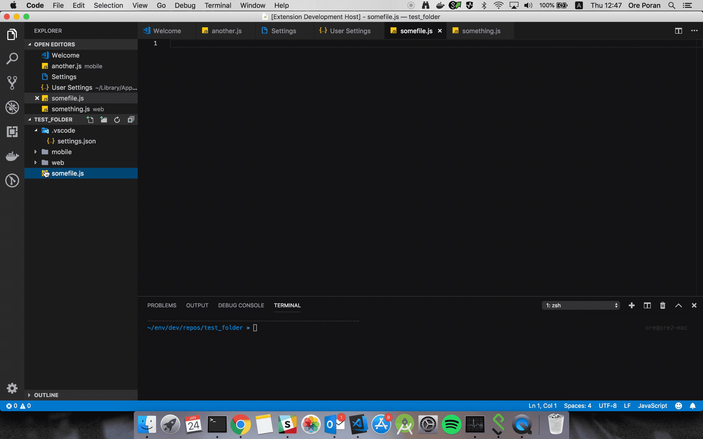

# color-tabs vscode extension README

## Features

## Extension Settings

This extension contributes the following settings:

* `ColorTabs.paths`: array of regex's i.e ['.*web.*', '.*mobile.*']
* `ColorTabs.colors`: array of colors i.e ["#ff0000", "#00ff00"]
