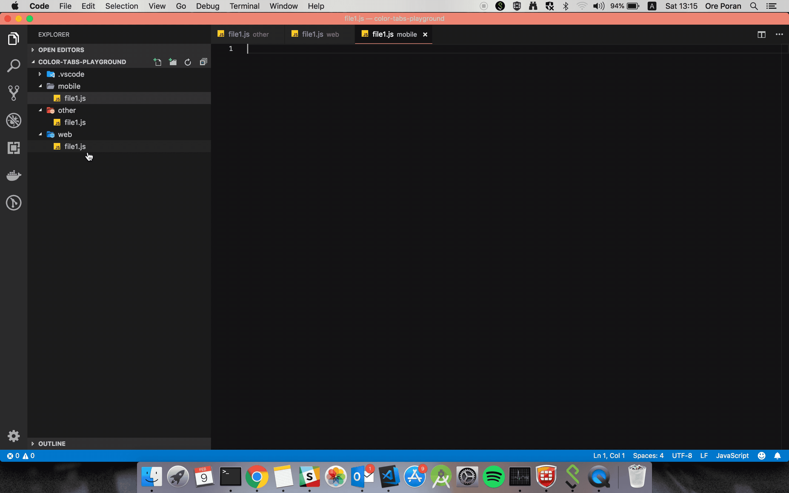
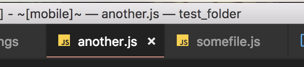

# ColorTabs for vscode

[](https://marketplace.visualstudio.com/items?itemName=orepor.color-tabs-vscode-ext#overview)
[](https://marketplace.visualstudio.com/items?itemName=orepor.color-tabs-vscode-ext#overview)




# What's new

## [0.6.0]

- ColorTabs now changes the color of your status bar (set to `true` by default) - [PR #10](https://github.com/oreporan/color-tabs-vscode/pull/10).    
set `colorTabs.statusBarBackground` to `true` in your workspace settings to get this new feature.

- ColorTabs can now change the color of your activity bar (Left side bar) - [PR #10](https://github.com/oreporan/color-tabs-vscode/pull/10).    
set `colorTabs.activityBarBackground` to `true` in your workspace settings to get this new feature.


## [0.5.0]

- ColorTabs can now add a label to your title background as well - [PR #4](https://github.com/oreporan/color-tabs-vscode/pull/4).    
set `colorTabs.titleLabel` to `true` in your workspace settings to get this new feature.
Example (with `mobile` label):



## [0.4.4]

- ColorTabs can now color your title background as well - [PR #2](https://github.com/oreporan/color-tabs-vscode/pull/2).    
set `colorTabs.titleBackground` to `true` in your workspace settings to get this new feature.
Example:


## Common Use Cases

1. Working on a monorepo, this extension can help you quickly understand if the current file is where you want to be.

For example your repo has both server and client, so this extension will color the client file tabs in one color, and the server file tabs in another.

Another use case is for repos that have both reactJS and react-native files.
Many times the files have the same names but are just in different directories like:

`mobile/Component.tsx`     
`web/Component.tsx`

With this extension you can easily differntiate between the two.

2. Accidentaly writing code in build/auto-generated files -     
Sometimes you start writing in some file and realize its an auto-generated file that will get over-written. Frustrating right?
Try this plugin with this regex:
```json
"colorTabs.config": [
        {
            "regex": ".*\/build\/.*",
            "color": "#FF0000"
        }
    ]
"colorTabs.titleBackground": true    
```

And `BOOM` - your build files are now in red. No more mistakes!


## Extension Settings

This extension contributes the following settings:

* `colorTabs.config`:  list of mappings from path to color         
"default": [{"regex": ".*\/web\/.*", "color": "#ff0000"},{"regex": ".*\/mobile\/.*", "color":  "#00ff00"}],

* `colorTabs.titleBackground`:  Enable title background coloring. default to `false`


A `workspace.settings` example : 

```json
"colorTabs.config": [
        {
            "regex": ".*\/mobile\/.*",
            "color": "#FF0000",
            "label": "MOBILE",
        },
        {
            "regex": ".*\/web\/.*",
            "color": "#00FF00",
            "label": "WEB",
        },{
            "regex": ".*\/docs\/.*",
            "color": "#0000FF",
            "label": "DOCS",
        },
    ]
"colorTabs.titleBackground": true    
```

## Known Issues
* This plugin writes to your vscode workspace `settings.json`, this means that it creates a git commit. To avoid pushing this change, you should have your `.vscode` directory in `.gitignore`. Currently writing to the `settings.json` is the only way to manipulate the colors in runtime.
