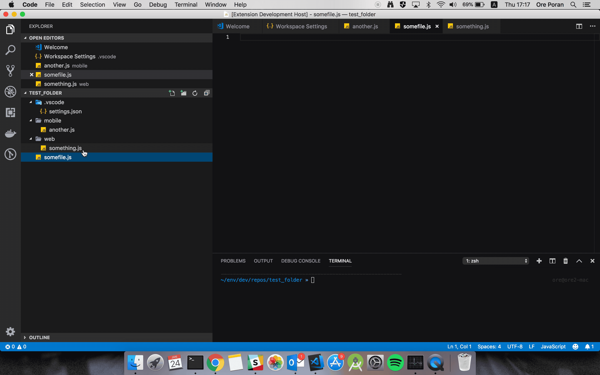

# ColorTabs for vscode

[](https://marketplace.visualstudio.com/items?itemName=orepor.color-tabs-vscode-ext#overview)
[](https://marketplace.visualstudio.com/items?itemName=orepor.color-tabs-vscode-ext#overview)



## Use Cases

If you're working on a monorepo and using vscode, this extension can help you quickly understand if the current file is where you want to be.

For example your repo has both server and client, so this extension will color the client file tabs in one color, and the server file tabs in another.

Another use case is for repos that have both reactJS and react-native files.
Many times the files have the same names but are just in different directories like `mobile/Component.tsx` and `web/Component.tsx`.
With this extension you can easily differntiate between the two.


## Extension Settings

This extension contributes the following settings:

* `colorTabs.config`:  list of mappings from path to color         
"default": [{"regex": ".*\/web\/.*", "color": "#ff0000"},{"regex": ".*\/mobile\/.*", "color":  "#00ff00"}],

* Tab borders are colored by default, you can turn this off by adding `"colorTabs.tabBorder" : false` to settings.json 

* You can also enable title background coloring. This can be done by adding `"colorTabs.titleBackground" : true` to settings.json

For example: 

```
// To settings.json  => workspace settings. 
"colorTabs.config": [
        {
            "regex": ".*\/red\/.*",
            "color": "#FF0000"
        },
        {
            "regex": ".*\/green\/.*",
            "color": "#00FF00"
        },{
            "regex": ".*\/blue\/.*",
            "color": "#0000FF"
        },
        {
            "regex": ".*",
            "color": "#000000"
        },
    ]
```

